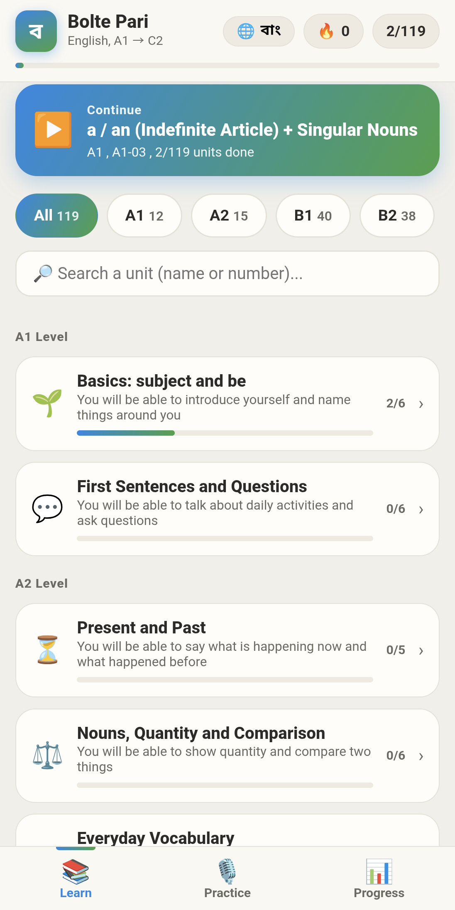
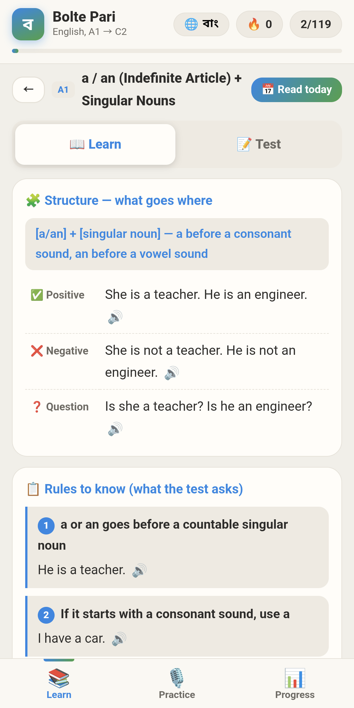
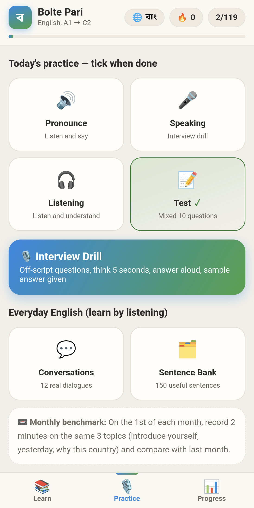
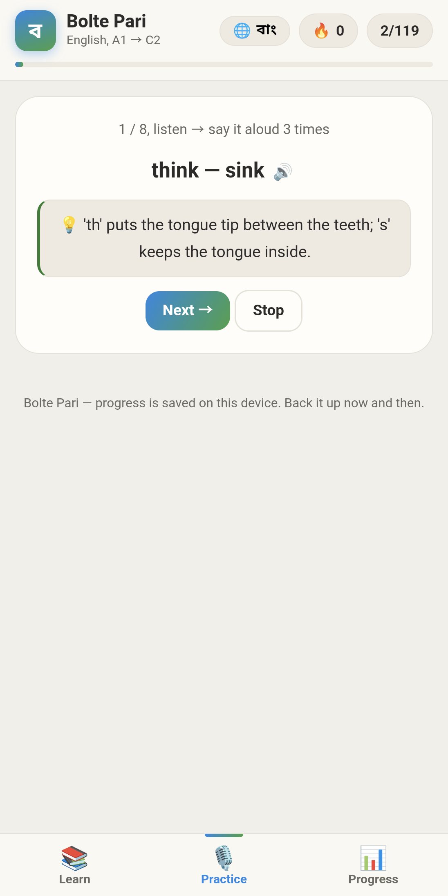

# Bolte Pari

**Learn English offline — from A1 to C2 — and get ready to speak.**

Bolte Pari (Bengali for "I can speak") is a free, offline English-learning app
that takes you from absolute beginner (A1) all the way to advanced mastery (C2).
It ships with **119 units**, **1,428 practice questions**, an **interview drill**
with model answers, and built-in listening practice — all working without an
internet connection.

> Independent self-study tool. Not affiliated with any exam board, language
> institute, embassy, or government program. See the disclaimer below.

---

## Screenshots

| Home (chapters) | Lesson (learn) | Practice hub | Pronunciation |
|------|--------|----------|-----------------|
|  |  |  |  |

---

## What it is

Bolte Pari is a structured, self-paced English course you carry in your pocket
or run on your desktop. Every lesson, question, and answer lives inside the app,
so you can study on a bus, on a plane, or anywhere with no signal. There are no
accounts to create and no data to upload — your progress stays on your device.

## Key Features

| Feature | Description |
|---------|-------------|
| **Fully offline** | All content and progress are stored locally. No internet required after install. |
| **A1 → C2 path** | A complete CEFR-aligned journey across **119 units**. |
| **1,428 practice questions** | Reinforce every unit with a large, structured question bank. |
| **Progress tracking** | Your scores and completion are saved on-device as you go. |
| **Interview drill** | Practice common interview questions with **model answers** to learn from. |
| **Text-to-speech listening** | Hear words and sentences read aloud to train your ear and pronunciation. |
| **Streak** | A daily streak keeps you motivated to practice consistently. |
| **No account needed** | Open the app and start — no sign-up, no login. |

## Platforms

Bolte Pari is available for **Android**, **Windows**, and **Linux**.

- The **Android** build shows ads (Google AdMob) to support development.
- The **Windows** and **Linux** builds are **ad-free**.

---

## Installation

Download the latest builds from the
[**Releases**](https://github.com/masudinfosec/BoltePari/releases) page.
<!-- Update the link above to your actual repository/release URL -->

### Android (sideload APK)

Bolte Pari for Android is distributed as an APK you install directly.

1. Download `BoltePari-<version>.apk` from the latest release.
2. Open the file. Android will ask for permission to install from this source.
3. Enable **Install unknown apps** (also called **Unknown sources**) for the app
   you used to open the APK — for example: **Settings → Apps → Special app
   access → Install unknown apps → (your browser/file manager) → Allow from this
   source**. Menu names vary by device and Android version.
4. Tap **Install**, then open Bolte Pari.

> Sideloading is normal for apps distributed outside an app store. Only install
> APKs you downloaded from this project's official Releases page.

### Windows

1. Download `BoltePari-<version>-setup.exe` (or the portable `.zip`) from the
   latest release.
2. Run the installer and follow the prompts, or unzip the portable build and run
   `BoltePari.exe`.
3. If Windows SmartScreen appears for an unsigned build, choose **More info →
   Run anyway** if you trust the source.

### Linux

1. Download the Linux build (`.AppImage`, `.deb`, or `.tar.gz`) from the latest
   release.
2. **AppImage:** make it executable and run it —
   ```bash
   chmod +x BoltePari-<version>.AppImage
   ./BoltePari-<version>.AppImage
   ```
3. **.deb (Debian/Ubuntu):**
   ```bash
   sudo dpkg -i bolte-pari_<version>_amd64.deb
   ```

---

## Tech

- **Android:** a **WebView**-based app that renders the learning experience,
  with **Google AdMob** for advertising and **Google UMP** for EEA/UK consent.
- **Desktop (Windows & Linux):** built with **Tauri**, wrapping the same
  web-based UI in a lightweight native shell (no ads on desktop).
- **Storage:** all content and user progress are kept in **local on-device
  storage** — no server, no accounts, no cloud sync.
- **Listening:** uses the platform's **text-to-speech** engine.

---

## Content & License

Bolte Pari uses a **split license**:

- **Application code** is open source under the **MIT License** — see
  [`LICENSE-CODE`](LICENSE-CODE).
- **Learning content** (lesson text, practice questions, explanations, and model
  answers) is **© 2026 masudinfosec, All Rights Reserved** and may **not** be
  redistributed or resold — see [`CONTENT-LICENSE.md`](CONTENT-LICENSE.md).

In short: you're welcome to study, reuse, and build on the code, but the course
material itself is not open for redistribution.

## Privacy

Bolte Pari collects no personal information itself and has no user accounts. The
Android version shows Google AdMob ads (with Google UMP consent for EEA/UK/Swiss
users); the desktop versions are ad-free. Full details are in
[`PRIVACY_POLICY.md`](PRIVACY_POLICY.md).

---

## Disclaimer

Bolte Pari is an **independent self-study tool** created by an individual author.
It is **not affiliated with, endorsed by, or connected to** any examination
board, official language-testing organization, embassy, ministry, or government
program. Studying with this app does not guarantee any test score, certification,
visa, or migration outcome. Use it as one resource among many on your own
learning journey.

## Author

Created and maintained by **masudinfosec**.

- Contact: socialmasud24@gmail.com
